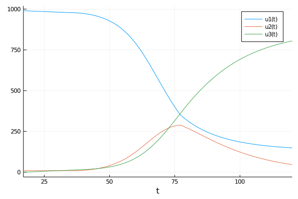
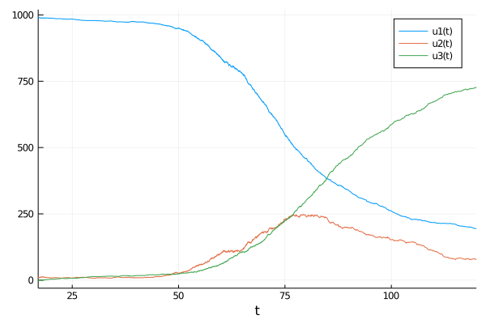

# CHIME Model

The folder contains implementations of the [CHIME COVID-19
Model](https://github.com/CodeForPhilly/chime). This model is an SIR
epidemiological model where the rate of infection changes over time to represent
policy changes such as shelter in place orders or masking requirements.

Both
[`chime.jl`](https://github.com/AlgebraicJulia/AlgebraicPetri.jl/blob/petset/examples/covid/chime/chime.jl)
and
[`chime-cset.jl`](https://github.com/AlgebraicJulia/AlgebraicPetri.jl/blob/petset/examples/covid/chime/chime-cset.jl)
implement the same model. Here
[`chime.jl`](https://github.com/AlgebraicJulia/AlgebraicPetri.jl/blob/petset/examples/covid/chime/chime.jl)
represents building the model out of the composition of open systems using
AlgebraicJulia's Epidemiology module, and
[`chime-cset.jl`](https://github.com/AlgebraicJulia/AlgebraicPetri.jl/blob/petset/examples/covid/chime/chime-cset.jl)
uses the new C-Set implementation of Petri Nets that keeps track of initial
conditions and rates automatically. This is a new notation and has not yet been
built to support the open systems of decorated cospans, but this is on the way!

## Running the Models

To initialize the project in Julia, `cd` into this directory and run `julia
--project -e 'pkg"instantiate"'`

Once the project has been instantiated, both of these models can be run easily
from within this folder with `julia --project chime.jl` or `julia --project
chime-cset.jl`.

These models represented as a JSON format for interoperability purposes can be
found in
[`chime.json`](https://github.com/AlgebraicJulia/AlgebraicPetri.jl/blob/petset/examples/covid/chime/chime.json).
An explanation on how to read this schema can be found in
[`cset-json-schema.pdf`](https://github.com/AlgebraicJulia/AlgebraicPetri.jl/blob/petset/examples/covid/chime/cset-json-schema.pdf).

## Example Solutions

When running these models,
[`Petri.jl`](https://mehalter.github.io/Petri.jl/stable/) supports solvers using
ODEs, SDEs, and Gillespie discrete simulations. Some example outputs are shown
below with the following initial conditions and parameters:

- Policy changing every 20, 40, and then 60 days
- A relative contact rate of 0.05
- an infectious day length of 14
- And initial conditions of 990 susceptible, 10 infected, and 0 recovered

### ODE Solution

### SDE Solution

